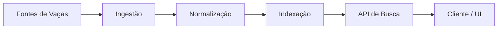
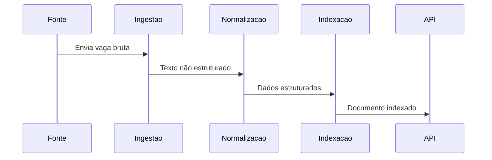

## Introdução

Buscar vagas de tecnologia parece simples à primeira vista, mas rapidamente se torna um problema complexo quando analisamos a **qualidade dos dados**, a **ambiguidade das descrições** e a **falta de semântica** nas plataformas tradicionais.

Termos como *"Full Stack"*, *"Pleno"* ou *"Experiência com cloud"* variam drasticamente de empresa para empresa. Em muitos casos, a busca se resume a *matching textual*, ignorando contexto técnico, stack real e senioridade.

Este artigo descreve a concepção, arquitetura e implementação de um **motor de busca focado exclusivamente em vagas de tecnologia**, explorando decisões técnicas, desafios encontrados e caminhos de evolução — incluindo o uso futuro de inteligência artificial.

O projeto é open source e está disponível em:
👉 [https://github.com/vitorvaf/job-search-engine](https://github.com/vitorvaf/job-search-engine)

---

## A Ideia do Projeto

A proposta do motor de busca parte de alguns princípios claros:

* **Stack-first**: tecnologia vem antes do cargo
* **Dados estruturados** a partir de textos não estruturados
* **Arquitetura evolutiva**, preparada para IA
* **Busca orientada a intenção**, não apenas palavras-chave

O objetivo não é apenas encontrar vagas que *contêm* determinado termo, mas vagas que **realmente façam sentido para um determinado perfil técnico**.

---

## Visão Geral da Arquitetura

A solução foi pensada de forma modular, separando claramente as responsabilidades entre coleta, processamento, indexação e busca.



### Componentes principais

* **Ingestão**: recebe vagas de diferentes fontes
* **Normalização**: transforma texto livre em dados estruturados
* **Indexação**: prepara os dados para busca eficiente
* **API de Busca**: expõe filtros e critérios de consulta

---

## Tecnologias Utilizadas

### Backend

* **Node.js / TypeScript**
* Arquitetura modular, com separação clara entre domínio, infraestrutura e aplicação
* Código orientado à legibilidade e evolução, não apenas performance prematura

### Banco de Dados

* Banco relacional para garantir consistência dos dados
* Modelagem focada em entidades de domínio como *Job*, *Stack*, *Seniority* e *Source*

### Busca

* Busca textual combinada com filtros estruturados
* Estratégia inicial baseada em *keyword matching* + *scoring*
* Preparado para evoluir para busca semântica

### Infraestrutura

* Docker para padronização do ambiente
* Projeto preparado para CI/CD

---

## Modelagem de Dados de Vagas

Um dos principais desafios é transformar descrições livres em dados estruturados.

Exemplo simplificado de uma vaga normalizada:

```json
{
  "title": "Software Engineer",
  "seniority": "Senior",
  "stack": ["Node.js", "TypeScript", "PostgreSQL"],
  "workModel": "Remote",
  "location": "Brazil",
  "source": "LinkedIn"
}
```

### Principais desafios

* Sinônimos técnicos (*JS* vs *JavaScript*)
* Overlapping de stacks
* Senioridade implícita
* Excesso de buzzwords

---

## Fluxo de Processamento de uma Vaga



---

## Estratégia de Busca e Ranking

O mecanismo de busca combina diferentes critérios:

* Match de stack
* Compatibilidade de senioridade
* Modelo de trabalho
* Penalização de vagas genéricas

Cada vaga recebe um *score*, permitindo ordenação por relevância.

Mesmo em sua versão inicial, a arquitetura permite ajustes finos de pesos e critérios, sem necessidade de reescrita estrutural.

---

## Preparação para Inteligência Artificial

Desde o início, o projeto foi pensado para permitir evolução com IA:

* Classificação automática de senioridade
* Extração semântica de stack a partir de texto livre
* Busca por intenção ("quero trabalhar com backend em cloud")


A IA entra como **camada de enriquecimento**, não como dependência crítica do core.

---

## Desafios Encontrados

* Dados extremamente heterogêneos
* Falta de padronização entre fontes
* Ambiguidade semântica
* Decisão entre performance imediata vs arquitetura futura

Esses desafios reforçaram a importância de **modelagem correta e decisões arquiteturais conscientes**, mesmo em projetos pessoais.

---

## Possíveis Evoluções

* Recomendação personalizada de vagas
* Alertas inteligentes
* Feedback loop usuário → ranking
* Treinamento de modelos próprios
* Matching candidato × vaga

---

## Conclusão

Mais do que um motor de busca, este projeto se tornou um **laboratório de arquitetura, dados e inteligência aplicada ao mercado de tecnologia**.

Ele demonstra como problemas aparentemente simples escondem desafios reais de engenharia — e como decisões bem fundamentadas permitem evolução contínua sem retrabalho.

O código é open source e contribuições são bem-vindas.
