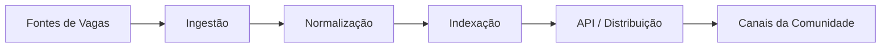
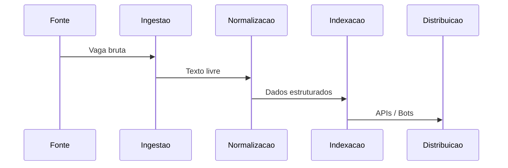

## Introdução

Buscar vagas de tecnologia parece simples à primeira vista, mas rapidamente se torna um problema complexo quando analisamos a **qualidade dos dados**, a **ambiguidade das descrições** e a **falta de semântica** nas plataformas tradicionais.

Termos como *“Pleno”*, *“Full Stack”* ou *“Experiência com cloud”* variam drasticamente entre empresas, e muitas plataformas ainda se baseiam apenas em *matching textual*, ignorando contexto técnico, stack real e senioridade.

Este projeto nasceu com um propósito claro: **automatizar e evoluir a divulgação e a busca de vagas para ajudar a comunidade de tecnologia**, apoiando o trabalho voluntário de **Rafael Quevedo**, que utiliza o Instagram **@querovagas23** para divulgar oportunidades sem fins lucrativos.

O projeto é open source e está disponível em:  
👉 https://github.com/vitorvaf/job-search-engine

---

## Motivação e Contexto Comunitário

Rafael Quevedo atua diariamente na curadoria e divulgação de vagas de tecnologia, utilizando redes sociais como principal canal de distribuição. Com o crescimento do volume de oportunidades, surgiram desafios claros:

- Alto custo manual de curadoria
- Dificuldade de padronização das vagas
- Falta de filtros técnicos precisos
- Necessidade de automação e escala

Este motor de busca surge como uma **ferramenta de apoio**, automatizando tarefas repetitivas e permitindo foco no que realmente importa: **ajudar pessoas a encontrar oportunidades relevantes**.

---

## Visão Geral da Arquitetura

A arquitetura foi pensada de forma modular, permitindo evolução incremental e integração com novos canais.



### Componentes

- **Ingestão**: coleta vagas de múltiplas fontes
- **Normalização**: converte texto livre em dados estruturados
- **Indexação**: organiza dados para busca eficiente
- **API / Distribuição**: fornece dados para bots, canais e futuras UIs

---

## Stack Tecnológica Real do Projeto

O projeto foi desenvolvido inteiramente em **C#**, utilizando o ecossistema **.NET** como base principal.

### Stack Principal

- **C# / .NET**
- **Arquitetura modular**
- **Docker** para padronização de ambiente
- Estrutura preparada para APIs, processamento e automações

A escolha do .NET se deu pela robustez, tipagem forte e facilidade de evolução para cenários de alta complexidade e integração futura com IA.

---

## Modelagem de Dados de Vagas

O núcleo do projeto está na transformação de dados não estruturados em informações úteis.

Exemplo de vaga normalizada:

```json
{
  "title": "Desenvolvedor Backend",
  "stack": ["C#", ".NET", "SQL Server"],
  "seniority": "Pleno",
  "workModel": "Remoto",
  "location": "Brasil",
  "source": "Comunidade"
}
```

### Desafios enfrentados

- Variações semânticas de stack
- Senioridade implícita
- Excesso de buzzwords
- Dados inconsistentes entre fontes

---

## Fluxo de Processamento de Vagas



---

## Estratégia de Busca e Distribuição

A busca não se limita a palavras-chave. O motor considera:

- Compatibilidade de stack
- Senioridade
- Modelo de trabalho
- Organização dos dados para redistribuição automática

Isso permite não apenas buscar vagas, mas **distribuí-las de forma inteligente para canais da comunidade**.

---

## Preparação para Inteligência Artificial

O projeto foi desenhado para evolução com IA, sem acoplamento direto ao core.


Possibilidades futuras:
- Classificação automática de senioridade
- Extração semântica de skills
- Busca por intenção
- Ranking inteligente

---

## Impacto Social e Comunitário

Este projeto tem como objetivo **potencializar iniciativas comunitárias**, reduzindo esforço manual e ampliando alcance.

Ele não visa monetização, mas sim **impacto positivo**, reforçando a importância de tecnologia como ferramenta de inclusão.

---

## Possíveis Evoluções

- Alertas personalizados
- Matching candidato × vaga
- Bots inteligentes
- Feedback loop da comunidade
- Dashboards de vagas por stack

---

## Conclusão

Este motor de busca representa mais do que um experimento técnico. Ele é um **projeto com propósito**, combinando engenharia de software, automação e impacto social.

Ao apoiar iniciativas como a de Rafael Quevedo, o projeto demonstra como soluções técnicas bem arquitetadas podem gerar valor real para a comunidade de tecnologia.
